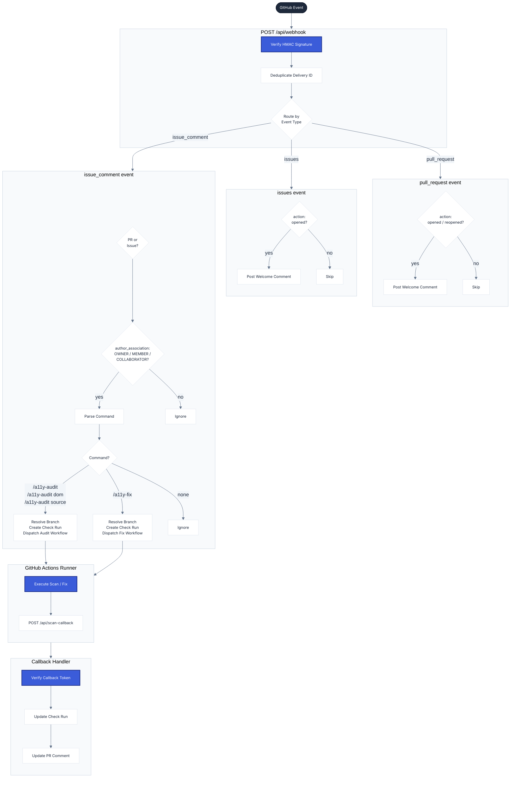
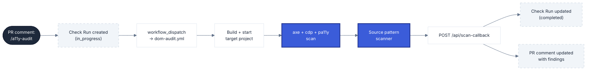

# Architecture

**Navigation**: [Home](../README.md) • [Architecture](architecture.md) • [Commands](commands.md) • [Configuration](configuration.md) • [Runner Setup](runner-setup.md) • [Fix Engine](fix-engine.md)

---

## Table of Contents

- [Overview](#overview)
- [End-User Flows](#end-user-flows)
- [Request Flow](#request-flow)
- [Internal Component Roles](#internal-component-roles)
- [Audit Data Flow](#audit-data-flow)
- [Fix Data Flow](#fix-data-flow)
- [Local Development](#local-development)

## Overview

The A11y GitHub App is a webhook server that listens to GitHub events on installed repositories. When a pull request is opened, an issue is created, or a comment containing a command is posted on either, the app authenticates the request, determines the action, and dispatches GitHub Actions workflows to a configured runner repository. The runner performs the actual scanning or fix work and reports results back via a callback endpoint. The app then updates the GitHub Check Run and the comment with the final results.

The app supports two contexts:
- **Pull Request**: audit/fix the PR head branch. Commands in PR comments.
- **Issue**: audit/fix any branch in the repo (defaults to the repo's default branch). Commands in issue comments. Use `branch:X` to target a specific branch.

## End-User Flows

### PR Flow

1. PR opened → bot posts a welcome comment listing all available commands
2. Collaborator comments `/a11y-audit` → app creates a Check Run and dispatches `dom-audit.yml`
3. Runner builds the target project, runs axe + cdp + pa11y + source pattern scanner
4. Results posted as a single editable PR comment (finding IDs, severity, selectors, WCAG)
5. Collaborator comments `/a11y-fix all` → app dispatches `a11y-fix.yml`
6. Runner applies AI patches, verifies each one, commits to a new branch, opens a fix PR

### Issue Flow

1. Issue opened → bot posts a welcome comment listing all available commands
2. Collaborator comments `/a11y-audit` → audits the repo's default branch
3. `/a11y-audit branch:stage` → resolves that branch via the GitHub API and audits it
4. Results posted as an issue comment with finding IDs and fix commands (automatically include `branch:X`)
5. `/a11y-fix all` → same patch + PR flow as PRs, targeting the audited branch

### Slack Flow

1. User types `/a11y` in any channel → modal opens (repo URL, branch, audit mode)
2. Submit → app dispatches the audit workflow; a scanning message appears in the channel
3. Workflow reports progress → message updates live with a progress bar (6 steps)
4. Scan completes → results posted to Slack
5. **Fix All** button in Slack → fix modal opens (model, hint) → fix workflow dispatched
6. Fix completes → Slack message updated with patch results and a link to the fix PR

## Request Flow



## Internal Component Roles

| File | Responsibility |
|------|----------------|
| `src/webhook/process.ts` | Entry point for all webhook events. Verifies HMAC signature, deduplicates deliveries, routes to `pull_request`, `issues`, or `issue_comment` handler, posts welcome comments (PR and Issue), checks author association, parses commands, resolves branch references (PR head or issue branch), creates Check Runs, and dispatches workflows. |
| `src/webhook/dom-callback.ts` | Handles `POST /api/scan-callback`. Validates the callback token with a timing-safe comparison, normalizes the findings payload, builds the final comment body (DOM section, source pattern section, quick-fix section), updates the Check Run to `completed`, and updates or creates the comment. Supports `branch` parameter to include `branch:X` in fix commands for issue-based scans. When Slack context is present in the callback payload, also posts results to Slack via `chat.update`. |
| `src/slack/handler.ts` | Entry point for Slack interactions. Verifies Slack signing secret, routes slash commands (`/a11y`), modal submissions (audit and fix), and button actions (Fix, Fix All). Opens Block Kit modals, resolves repos/branches, dispatches workflows, and posts progress messages. |
| `src/slack/progress.ts` | Handles `POST /api/slack-progress`. Receives progress updates from GitHub Actions workflows and updates the Slack message with a progress bar showing the current step. |
| `src/slack/formatter.ts` | Converts `DomAuditSummary` into Slack Block Kit blocks. Handles severity icons, finding overflow (max 20 DOM + 10 pattern), and action buttons per finding. |
| `src/slack/notifier.ts` | Wraps Slack `chat.postMessage` and `chat.update` calls. All calls are non-fatal — failures are logged but never block GitHub posting. |
| `src/review/audit-command.ts` | Parses audit commands from comment text. Matches `/a11y-audit`, `/a11y-audit dom`, and `/a11y-audit source` and returns an `AuditCommand` with `auditMode` and optional `branch`. Validates that `branch:` has a value — bare `branch` without a value returns null. |
| `src/review/fix-command.ts` | Parses fix commands from comment text. Matches `/a11y-fix` followed by one or more finding IDs (or `all`), an optional model name, and an optional hint. Returns a `FixCommand` with the resolved `findingIds` array and optional `branch`. Bare `branch` without a value returns an invalid command. |
| `src/review/dom-workflow.ts` | Dispatches `workflow_dispatch` events to the runner repo for DOM audits and source-only audits. Also provides `createScanToken()` which generates a unique, URL-safe token per PR scan. |
| `src/review/fix-workflow.ts` | Dispatches `workflow_dispatch` events to the runner repo for fix runs. Passes all required inputs including finding IDs, target repo coordinates, installation token, and AI model. |
| `src/review/dom-reporter.ts` | Creates and updates GitHub Check Runs (`A11y Audit`, `A11y Fix`). Provides `createDomAuditPendingCheck`, `completeDomAuditCheck`, `createFixPendingCheck`, and `failDomAuditCheck`. |
| `src/config.ts` | Single source of truth for all environment variable configuration. Reads required vars at startup and throws if any are missing. |
| `.github/workflows/dom-audit.yml` | Runner workflow for DOM audits. Builds and starts the target project locally, runs `a11y-audit` (axe + cdp + pa11y engines), optionally runs the source pattern scanner, caches findings by head SHA, and POSTs the callback payload. Timeout: 20 minutes. |
| `.github/workflows/source-audit.yml` | Runner workflow for source-only audits. Checks out target repo and runs the source pattern scanner only. Caches pattern findings by head SHA and POSTs the callback payload. Timeout: 10 minutes. |
| `.github/workflows/a11y-fix.yml` | Runner workflow for automated fixes. Restores cached findings, resolves finding IDs, applies patches per finding with git checkpointing, re-runs the audit for verification, commits passing patches to a new branch, and opens a PR. Timeout: 25 minutes. |

## Audit Data Flow



## Fix Data Flow

```mermaid
%%{init: { 'theme': 'base', 'themeVariables': { 'primaryColor': '#3b5cd9', 'primaryTextColor': '#1e293b', 'primaryBorderColor': '#1e308a', 'lineColor': '#64748b', 'secondaryColor': '#f1f5f9', 'tertiaryColor': '#fff', 'mainBkg': '#fff', 'nodeBorder': '#e2e8f0', 'clusterBkg': '#f8fafc', 'clusterBorder': '#cbd5e1' } } }%%
flowchart LR
    CMD2(["PR comment:<br/>/a11y-fix A11Y-001"])
    CR3["Check Run created<br/>(in_progress)"]
    WF2["workflow_dispatch<br/>→ a11y-fix.yml"]
    CACHE["Restore findings<br/>from cache"]
    APPLY["Apply patch per finding<br/>(git checkpoint)"]
    AI["Claude API<br/>generates patch"]
    VERIFY["Re-run audit<br/>for verification"]
    BRANCH["Commit to<br/>new branch"]
    PR["Open PR with<br/>fix summary"]
    CR4["Check Run updated<br/>(completed)"]

    CMD2 --> CR3 --> WF2 --> CACHE --> APPLY
    AI --> APPLY
    APPLY --> VERIFY --> BRANCH --> PR --> CR4

    classDef default font-family:Inter,sans-serif,font-size:12px;
    classDef core fill:#3b5cd9,color:#fff,stroke:#1e308a,stroke-width:2px;
    classDef trigger fill:#1e293b,color:#fff,stroke:#0f172a;
    classDef storage fill:#f1f5f9,stroke:#cbd5e1,stroke-dasharray: 5 5;

    class APPLY,AI,VERIFY core;
    class CMD2 trigger;
    class CR3,CR4,CACHE,BRANCH,PR storage;
```



## Local Development

```bash
npm install
npm run dev        # starts the local server on PORT (default 8787)
```

Use [ngrok](https://ngrok.com/) to expose the local server for webhook testing:

```bash
ngrok http 8787
```

Update the GitHub App webhook URL to the ngrok URL while testing. Set `APP_BASE_URL` in `.env` to the ngrok URL so callback URLs are built correctly.

Create a `.env` file in the project root with the required variables (see the [Configuration](configuration.md) reference).

**Run tests:**

```bash
npm test
```

Tests use Vitest and cover the webhook handler, review logic, and Slack callback flow.
