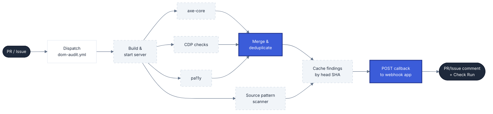

# Audit Engine

**Navigation**: [Home](../README.md) • [Architecture](architecture.md) • [Configuration](configuration.md) • [Runner Setup](runner-setup.md) • [Slack Setup](slack-setup.md) • [Jira Setup](jira-setup.md) • [Audit Engine](audit-engine.md) • [Fix Engine](fix-engine.md)

---

## Table of Contents

- [Overview](#overview)
- [Scanners](#scanners)
  - [Axe-core](#axe-core)
  - [CDP (Chrome DevTools Protocol)](#cdp-chrome-devtools-protocol)
  - [Pa11y](#pa11y)
  - [Deduplication](#deduplication)
- [Source Pattern Scanner](#source-pattern-scanner)
- [Finding IDs](#finding-ids)
- [Result Caching](#result-caching)
- [Audit Output Format](#audit-output-format)
- [Fix Result Statuses](#fix-result-statuses)

## Overview

The audit engine runs inside the `dom-audit.yml` GitHub Actions workflow. It orchestrates three browser scanners (axe, CDP, pa11y) and a static source pattern scanner, merges and deduplicates their output, and POSTs the findings back to the webhook app via a signed callback.



## Scanners

The three DOM scanners run against the target project served locally on the runner. The server is started after the build completes and polled until it returns `200 OK`.

### Axe-core

Runs WCAG 2.x compliance checks via `@axe-core/playwright` against every crawled route. Tags: `wcag2a`, `wcag2aa`, `wcag21aa`, `wcag22aa`. Forms the baseline — all axe findings are added first before the other scanners contribute.

### CDP (Chrome DevTools Protocol)

Runs on the same Playwright page after axe. Catches issues axe does not cover:

- Interactive elements without accessible names
- `aria-hidden` on focusable elements
- Missing main landmark
- Missing skip link
- Autoplay media

CDP rules define `axeEquivalents` — if the same violation was already found by axe, the CDP finding is dropped.

### Pa11y

Runs in parallel using a shared Puppeteer browser to hide startup latency. Uses HTML CodeSniffer to detect heading hierarchy, link purpose, and form association issues. Pa11y rules are mapped to axe-equivalent IDs via an equivalence map; unrecognized rules are prefixed `pa11y-*`.

### Deduplication

All three scanners feed into a single merge step keyed on `ruleId::selector`. A finding is included once — the first scanner to report a given `ruleId` + `selector` combination wins. This prevents the same broken element from appearing multiple times under different scanner names.

## Source Pattern Scanner

Runs independently of the browser scanners — no server required. Analyzes source files using regex patterns to detect accessibility anti-patterns at the code level:

- Suppressed focus outlines (`outline: none`)
- `onClick` handlers on non-interactive elements
- Missing ARIA labels on icon buttons
- Hardcoded color values that may fail contrast

The source scanner runs during the DOM audit workflow (unless `SOURCE_PATTERNS_ENABLED=false`) and also has its own dedicated `source-audit.yml` workflow.

## Finding IDs

| Type | Format | Example | Generation logic |
|------|--------|---------|-----------------|
| DOM | `A11Y-###` | `A11Y-001` | Sequential index, zero-padded to 3 digits |
| Pattern | `PAT-######` | `PAT-a1b2c3` | First 6 chars of SHA-256(`patternId\|\|file\|\|line`) |

PAT-* IDs are stable across reruns — the same pattern at the same file and line always produces the same ID. A11Y-* IDs are positional within a scan run.

## Result Caching

Findings are cached in GitHub Actions by head SHA after each audit run. The fix workflow restores these caches to resolve finding IDs without re-auditing.

| Cache key | Contents |
|-----------|----------|
| `a11y-findings-{head_sha}` | DOM audit results (`findings/a11y-findings.json`) |
| `a11y-pattern-findings-{head_sha}` | Source pattern results (`findings/a11y-pattern-findings.json`) |
| `a11y-remediation-{head_sha}` | Generated remediation guidance |

## Audit Output Format

Findings in the PR/Issue comment are sorted by severity (Critical → Serious → Moderate → Minor).

**Severity icons**:

| Icon | Severity |
|------|----------|
| 🔴 | Critical |
| 🟠 | Serious |
| 🟡 | Moderate |
| 🔵 | Minor |

**DOM finding entry**:
```
1. 🔴 [Critical] Images must have alternative text
   WCAG: wcag111
   Selector: `img.hero-image`
   Fix: `/a11y-fix A11Y-001`
```

**Source pattern finding entry**:
```
1. 🟠 [Serious] Suppressed focus outline
   File: `src/components/Button.css:42`
   Rule: `no-outline-none`
   Fix: `/a11y-fix PAT-001`
```

If findings exceed the inline limit (default 30), the comment shows the first 30 and notes the total count. The **Quick Fix** section below always shows the fix command shortcuts.

## Fix Result Statuses

| Icon | Status | Description |
|------|--------|-------------|
| ✅ | Fixed & verified | Patch applied and DOM re-audit confirmed the violation no longer appears at the same selector. |
| ⚠️ | Patched but not verified | Patch applied but re-verification was skipped or inconclusive. |
| ⏭️ | Skipped | Search block not found — the code was already patched by an earlier finding in the same run. |
| ❌ | Failed | Claude could not produce a valid patch, or the patch could not be applied. The git checkpoint is restored so prior patches survive. |
