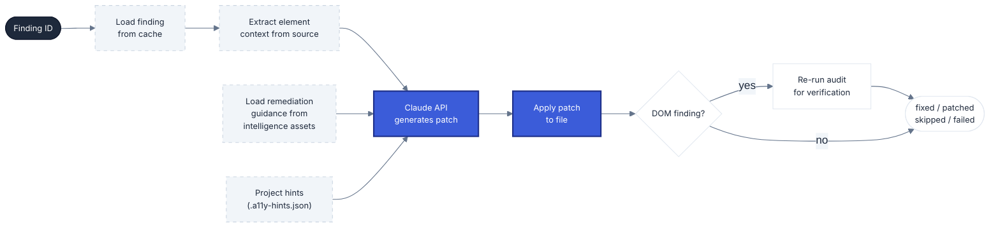

# Fix Engine

**Navigation**: [Home](../README.md) • [Architecture](architecture.md) • [Commands](commands.md) • [Configuration](configuration.md) • [Runner Setup](runner-setup.md) • [Slack Setup](slack-setup.md) • [Jira Setup](jira-setup.md) • [Fix Engine](fix-engine.md)

---

## Table of Contents

- [Overview](#overview)
- [Fix Flow](#fix-flow)
- [Intelligence Assets](#intelligence-assets)
- [Fix Strategies](#fix-strategies)
  - [DOM Findings (A11Y-*)](#dom-findings-a11y-)
  - [Pattern Findings (PAT-*)](#pattern-findings-pat-)
- [Project Hints (.a11y-hints.json)](#project-hints-a11y-hintsjson)
- [Git Checkpoint Pattern](#git-checkpoint-pattern)
- [Fix Result Statuses](#fix-result-statuses)
- [AI Usage Reporting](#ai-usage-reporting)
- [Model Configuration](#model-configuration)

## Overview

The fix engine runs inside the `a11y-fix.yml` GitHub Actions workflow. For each finding, it follows a two-layer process:

- **The engine provides the knowledge**: it loads the finding from cache, extracts the element context from the source files, and supplies WCAG remediation guidance from its intelligence database.
- **Claude executes the fix**: it receives the element context + remediation guidance + any project hints and produces a concrete code patch (search/replace) for that specific file. Claude does not decide *what* to fix or *how* to fix it in the abstract — the engine's intelligence assets define that. Claude only translates the guidance into a change in the target file.



## Intelligence Assets

The engine's knowledge base lives in `assets/remediation/intelligence.mjs` — one entry per axe-core rule. Each entry defines what the rule means, how to fix it, and context for specific project.

When Claude receives a finding, the engine injects the rule's `fix.description`, `fix.code`, and the relevant `framework_notes` entry into the prompt. Claude never decides the remediation strategy — it only translates the pre-written guidance into a patch for the specific file.

```json
{
  "image-alt": {
    "category": "text-alternatives",
    "fix": {
      "description": "Add a descriptive alt attribute to every . Use alt=\"\" for decorative images.",
      "code": "\n<!-- Decorative image (hidden from AT): -->\n"
    },
    "framework_notes": {
      "react": "Use the alt prop directly on : . For decorative images: alt=\"\".",
      "vue": "Use :alt binding or plain alt attribute — standard HTML semantics apply.",
      "angular": "Use [attr.alt] binding or plain alt attribute on  elements.",
      "svelte": "Svelte's compiler enforces alt attributes on  at build time — missing alt triggers a warning. Use alt='' for decorative images.",
      "astro": "Astro's <Image /> component requires the alt prop by default. For plain  tags in .astro files, add alt manually."
    },
    "cms_notes": {
      "shopify": "Product images use {{ image | image_url }} with product.featured_image.alt as alt text. Add a fallback: alt='{{ image.alt | default: product.title }}'.",
      "wordpress": "WordPress stores alt text per attachment via update_post_meta($id, '_wp_attachment_image_alt', $value). Ensure custom rendering via wp_get_attachment_image() preserves the stored alt attribute.",
      "drupal": "Drupal's Image field requires alt text by default. In Twig templates, use {{ content.field_image }} which renders with the stored alt."
    },
    "guardrails_overrides": {
      "must": [
        "If visible text exists, preserve label-in-name: accessible name must include the visible label."
      ],
      "must_not": [
        "Do not add or replace aria-label when a valid accessible name already exists."
      ],
      "verify": [
        "Confirm computed accessible name matches expected spoken phrase."
      ]
    },
  }
}
```


---

## Fix Strategies

The engine selects a fix strategy based on the finding ID prefix.

### DOM Findings (A11Y-*)

DOM findings originate from the axe + cdp + pa11y browser scan. Each finding carries a CSS `selector` that uniquely identifies the element in the rendered page.

**Strategy**:
1. Load the finding from the DOM findings cache (`findings/a11y-findings.json`).
2. Use the CSS selector to locate the element in the target source files.
3. Call the Claude API with the element's HTML context and the recommended fix guidance from the engine's intelligence database.
4. Apply the generated patch to the target file.
5. After all findings in the batch have been patched, restart the local server and re-run `a11y-audit` with `--routes` and `--only-rule` targeting the specific pages and rules that were fixed.
6. Compare the re-scan results to the original: if the same `rule_id` + `selector` combination no longer appears, the finding is marked `verified` → status `fixed`.

### Pattern Findings (PAT-*)

Pattern findings originate from the static source pattern scanner. Each finding carries a `file` path and `line` number.

**Strategy**:
1. Load the finding from the pattern findings cache (`findings/a11y-pattern-findings.json`).
2. Open the target file at the recorded path and line number.
3. Call the Claude API with the surrounding code context and the pattern's remediation guidance.
4. Apply the generated patch to the target file.
5. No DOM re-verification is performed for pattern findings — the fix is marked `patched` after successful application.

## Project Hints (.a11y-hints.json)

You can customize how the AI applies fixes by placing an `.a11y-hints.json` file in the root of your target repository. The workflow reads this file before each fix run and passes its contents to the engine as project context.

**Example `.a11y-hints.json`:**

```json
{
  "labelStrategy": "sr-only",
  "cssFramework": "tailwind",
  "conventions": [
    "Use sr-only utility class for visually hidden labels instead of aria-label",
    "Button text must be wrapped in a <span class=\"sr-only\"> when using icon-only buttons"
  ]
}
```

The contents are injected verbatim into the Claude prompt as project context. Claude reads these conventions before generating any patch and applies them alongside the WCAG guidance from the engine's intelligence database.

**When the file is absent**, the workflow proceeds normally with no additional context — there is zero impact on runs where `.a11y-hints.json` does not exist.

**Supported fields** (all optional, free-form — Claude interprets them):

| Field | Example | Effect |
|-------|---------|--------|
| `labelStrategy` | `"sr-only"` | Preferred technique for visually hidden labels |
| `cssFramework` | `"tailwind"` | Tells Claude which utility classes are available |
| `conventions` | `["..."]` | Free-text rules Claude must follow when patching |

Any valid JSON is accepted. You can add any fields that describe your project's conventions — Claude reads the whole object.

## Git Checkpoint Pattern

Before each finding is processed, the workflow saves the current diff of the target directory to a checkpoint file:

```sh
git -C target diff > "$CHECKPOINT_FILE"
```

If the patch application fails or the finding status is not `patched`, the workflow resets the working tree to the pre-patch state and reapplies only the checkpoint (preserving any earlier successful patches in the same run):

```sh
git -C target checkout -- .
git -C target apply "$CHECKPOINT_FILE"
```

This ensures that a failure on finding N does not discard the patches already applied for findings 1 through N-1. Each finding in a multi-fix run is independent at the git level.

## Fix Result Statuses

| Status | Icon | Trigger Condition |
|--------|------|-------------------|
| `fixed` | ✅ | Patch was applied and DOM re-verification confirmed the `rule_id` + `selector` combination no longer appears in the re-scan results. |
| `patched` (unverified) | ⚠️ | Patch was applied but re-verification was skipped (pattern finding) or the re-scan result was inconclusive (selector not matched, scan failed). Reported as "Patched but not verified". |
| `skipped` | ⏭️ | The engine returned `"search block not found"` in its message — the code at the target location was already modified by an earlier finding in the same run, so there was nothing to patch. |
| `failed` | ❌ | The Claude API could not produce a valid patch, or the patch could not be applied to the file. The git checkpoint is restored so prior successful patches in the run are preserved. |

## AI Usage Reporting

Every `apply-finding-fix.mjs` invocation outputs `input_tokens` and `output_tokens` consumed by the Claude API for that finding. The workflow accumulates them across all findings in the run:

```sh
TOTAL_INPUT_TOKENS=$((TOTAL_INPUT_TOKENS + ${FINDING_INPUT_TOKENS:-0}))
TOTAL_OUTPUT_TOKENS=$((TOTAL_OUTPUT_TOKENS + ${FINDING_OUTPUT_TOKENS:-0}))
```

The totals are reported in both the fix PR description and the result comment posted on the original PR:

| Metric | Value |
|--------|-------|
| Model | The configured model (`haiku` by default) |
| Input tokens | Accumulated across all findings |
| Output tokens | Accumulated across all findings |
| Estimated cost | Calculated per-model from the pricing table |

**Cost formula**:

```
estimated_cost = (input_tokens × input_price + output_tokens × output_price) / 1,000,000
```

Pricing is looked up per model at runtime. The workflow maintains a pricing table keyed by model ID; unknown models produce `$0.000000`.

The result is formatted to 6 decimal places (e.g., `$0.000420`).

## Model Configuration

The Claude model used for patch generation is controlled by the `FIX_AI_MODEL` environment variable on the webhook app. Its value is forwarded to the runner workflow as the `ai_model` input at dispatch time and passed to `apply-finding-fix.mjs` via the `AI_MODEL` environment variable.

The default model is `haiku`. Model IDs are centralized in `src/models.ts` — update them there when new versions are released.

**Why Haiku is sufficient for most cases**: each patch task is narrow and well-scoped — the engine has already identified the element, extracted the source context, and pre-loaded the remediation guidance. Claude only needs to translate that into a search/replace change in a single file. Haiku handles this reliably at a fraction of the cost and latency of Sonnet or Opus. Consider upgrading to Sonnet only if patches consistently fail on particularly complex components or heavily abstracted codebases.
