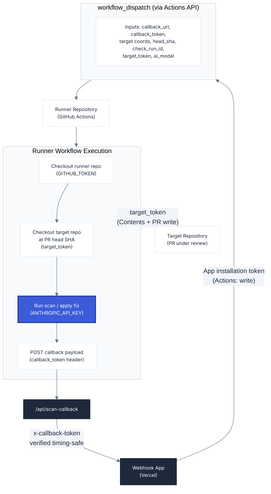

# Runner Setup

**Navigation**: [Home](../README.md) • [Architecture](architecture.md) • [Configuration](configuration.md) • [Runner Setup](runner-setup.md) • [Slack Setup](slack-setup.md) • [Jira Setup](jira-setup.md) • [Audit Engine](audit-engine.md) • [Fix Engine](fix-engine.md)

---

## Table of Contents

- [Overview](#overview)
- [Required Workflow Files](#required-workflow-files)
- [Required Secrets](#required-secrets)
- [Required Workflow Permissions](#required-workflow-permissions)
- [Runner Repository Configuration](#runner-repository-configuration)
- [Workflow Inputs Reference](#workflow-inputs-reference)
  - [dom-audit.yml inputs](#dom-audityml-inputs)
  - [source-audit.yml inputs](#source-audityml-inputs)
  - [a11y-fix.yml inputs](#a11y-fixyml-inputs)
- [Runner Interaction Diagram](#runner-interaction-diagram)
- [Target Project Runtime Config](#target-project-runtime-config)

---

## Overview

The app does not execute scans or fixes directly. Instead, it dispatches `workflow_dispatch` events to a **runner repository** — a GitHub repository that hosts the workflow files and has the `@diegovelasquezweb/a11y-engine` package installed as a Node.js dependency.

The runner can be the same repository as the one being scanned, or a dedicated repository shared across multiple projects.

The runner repository must have:
- The three workflow files committed to the branch referenced by `SCAN_RUNNER_REF`
- The `@diegovelasquezweb/a11y-engine` package available via `npm install`
- The `ANTHROPIC_API_KEY` Actions secret configured
- The GitHub App **installed** on it (if it is a dedicated runner repo — see below)

---

## Required Workflow Files

| File | Purpose | Timeout |
|------|---------|---------|
| `.github/workflows/dom-audit.yml` | Builds and starts the target project locally, runs axe + cdp + pa11y engines, optionally runs the source pattern scanner, caches findings, and posts the callback. | 20 min |
| `.github/workflows/source-audit.yml` | Checks out the target repository and runs the source pattern scanner only. Caches pattern findings and posts the callback. No browser required. | 10 min |
| `.github/workflows/a11y-fix.yml` | Restores cached findings, applies AI-generated patches per finding with git checkpointing, verifies patches, commits to a new branch, and opens a PR. | 25 min |

---

## Required Secrets

Configure these in the runner repository under **Settings → Secrets and variables → Actions → New repository secret**.

| Secret | Required | Where to get it | Description |
|--------|----------|-----------------|-------------|
| `ANTHROPIC_API_KEY` | **Yes** | [console.anthropic.com](https://console.anthropic.com) | API key used by `a11y-fix.yml` to call the Claude API for patch generation. Not read by the Vercel webhook app — must live in the runner repo. |

---

## Required Workflow Permissions

Each workflow file must declare `permissions` at the job level. These are the minimum permissions needed:

```yaml
permissions:
  contents: write       # push fix branches (a11y-fix.yml)
  pull-requests: write  # create fix PRs, post comments
  issues: write         # post comments on PRs (issues API)
```

`dom-audit.yml` and `source-audit.yml` only need `issues: write` (to post callback comments). `a11y-fix.yml` needs all three.

---

## Runner Repository Configuration

The runner repository is controlled by three environment variables on the Vercel app:

| Variable | Behavior |
|----------|----------|
| `SCAN_RUNNER_OWNER` | Owner of the runner repo. If empty, defaults to the target repository's owner. |
| `SCAN_RUNNER_REPO` | Name of the runner repo. If empty, defaults to the target repository name. |
| `SCAN_RUNNER_REF` | Branch or tag to dispatch workflows on. Defaults to `"master"`. |

---

## Workflow Inputs Reference

These inputs are sent by the Vercel app when dispatching each workflow. They are defined in the `workflow_dispatch.inputs` block of each workflow file.

### dom-audit.yml inputs

Dispatched by `dispatchDomAuditWorkflow()` in `src/review/dom-workflow.ts`.

| Input | Required | Description |
|-------|----------|-------------|
| `scan_token` | Yes | Unique token identifying this scan run. |
| `callback_url` | Yes | Full URL to POST results to (`{APP_BASE_URL}/api/scan-callback`). |
| `callback_token` | Yes | Token for the `x-callback-token` header, verified by the callback handler. Must match `DOM_AUDIT_CALLBACK_TOKEN` on Vercel. |
| `target_owner` | Yes | Owner of the repository being scanned. |
| `target_repo` | Yes | Name of the repository being scanned. |
| `pull_number` | Yes | PR number as a string. |
| `head_sha` | Yes | PR head commit SHA. Used to check out the target and as the findings cache key. |
| `check_run_id` | Yes | ID of the Check Run to update on callback. |
| `target_token` | Yes | GitHub installation token with write access to the target repository. |
| `comment_id` | No | ID of the initial comment to update with results. `"0"` = create a new comment. |
| `source_scan_enabled` | No | Whether to run the source pattern scanner (`"true"` / `"false"`). Set to `"false"` for `/a11y-audit dom`. |
| `branch` | No | Branch name being audited. Used in issue-based scans to include `branch:X` in fix commands. |
| `slack_channel_id` | No | Slack channel ID for progress updates and dual posting. |
| `slack_message_ts` | No | Slack message timestamp to update with progress. |
| `slack_thread_ts` | No | Slack thread timestamp. |

### source-audit.yml inputs

Dispatched by `dispatchSourceAuditWorkflow()` in `src/review/dom-workflow.ts`. Always sends `audit_mode: "source"` as a fixed value.

| Input | Required | Description |
|-------|----------|-------------|
| `scan_token` | Yes | Unique token identifying this scan run. |
| `callback_url` | Yes | Full URL to POST results to. |
| `callback_token` | Yes | Token for the `x-callback-token` header. |
| `target_owner` | Yes | Owner of the repository being scanned. |
| `target_repo` | Yes | Name of the repository being scanned. |
| `pull_number` | Yes | PR or issue number as a string. |
| `head_sha` | Yes | Target commit SHA. |
| `check_run_id` | Yes | ID of the Check Run to update on callback. |
| `target_token` | Yes | GitHub installation token with access to the target repository. |
| `comment_id` | No | ID of the initial comment to update with results. |
| `branch` | No | Branch name being audited. Used in issue-based scans. |
| `slack_channel_id` | No | Slack channel ID for progress updates and dual posting. |
| `slack_message_ts` | No | Slack message timestamp to update with progress. |
| `slack_thread_ts` | No | Slack thread timestamp. |

### a11y-fix.yml inputs

Dispatched by `dispatchFixWorkflow()` in `src/review/fix-workflow.ts`.

| Input | Required | Description |
|-------|----------|-------------|
| `target_owner` | Yes | Owner of the repository to fix. |
| `target_repo` | Yes | Name of the repository to fix. |
| `pull_number` | Yes | PR number as a string. |
| `head_sha` | Yes | PR head commit SHA. Used to restore cached findings. |
| `head_ref` | Yes | PR head branch name. The fix PR targets this branch. |
| `base_ref` | Yes | PR base branch. |
| `finding_ids` | Yes | Comma-separated finding IDs or `"all"`. |
| `requested_by` | Yes | GitHub username who triggered the fix command. |
| `target_token` | Yes | GitHub installation token for the target repository. |
| `check_run_id` | Yes | ID of the `A11y Fix` Check Run to update. |
| `ai_model` | No | Claude model for patch generation. Defaults to `haiku`. Controlled by `FIX_AI_MODEL` on Vercel. |
| `callback_url` | No | Base URL for Slack progress updates. Only sent for Slack-triggered fixes. |
| `callback_token` | No | Auth token for progress updates. Only sent for Slack-triggered fixes. |
| `slack_channel_id` | No | Slack channel ID for progress updates. |
| `slack_message_ts` | No | Slack message timestamp to update with progress. |
| `slack_thread_ts` | No | Slack thread timestamp. |

---

## Runner Interaction Diagram



---

## Target Project Runtime Config

### Automatic Stack Detection

The DOM audit and fix workflows **auto-detect the project stack** using a two-phase approach:

**Phase 1 — Pre-build detection** (checks `package.json`):
- If `package.json` exists → sets `installCommand: "npm install"` and `buildCommand: "npm run build"` (if a `build` script exists).
- If no `package.json` → falls back to the static file server default.

**Phase 2 — Post-build detection** (checks build output):
After install and build complete, the workflow detects the output directory and selects the appropriate server:

| Detected | Server command |
|----------|---------------|
| `out/index.html` | `npx serve out -l 4173` (static export) |
| `dist/index.html` | `npx serve dist -l 4173` (Vite, etc.) |
| `build/index.html` | `npx serve build -l 4173` (CRA, etc.) |
| `.next/` directory | `npx next start -p 4173` (Next.js) |
| None of the above | `python3 -m http.server 4173` (plain HTML) |
